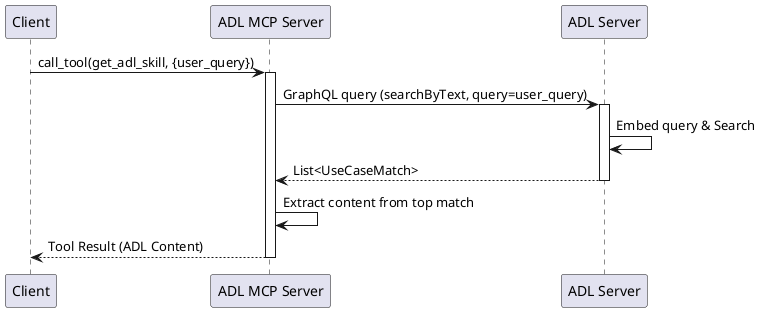

# 🧩 TechSpec: Add get_adl_skill Tool
**ID:** MCP-TOOL-001
**Service:** ADL MCP Server
---

## 🧩Key Functional Requirements

### Functional Requirements

- Expose a new tool named `get_adl_skill` in the MCP Server.
- The tool accepts a parameter `user_query` (String).
- The tool queries the `adl-server` to search for relevant ADLs based on the user query.
- The tool returns the content of the most relevant ADL found.

### Main Flow (step-by-step)

1.  MCP Client calls `get_adl_skill` with `user_query`.
2.  `adl-mcp-server` constructs a GraphQL query to call `adl-server`.
    - Query: `searchByText`
    - Input: `query: user_query`
3.  `adl-mcp-server` sends the request to `adl-server` GraphQL endpoint.
4.  `adl-server` processes the query using `AdlQuery.searchByText`.
5.  `adl-server` returns a list of `UseCaseMatch`.
6.  `adl-mcp-server` processes the response.
    - If matches found, return the `content` of the top match.
    - If no matches, return a message indicating no relevant ADL found.

#### Sequence Diagram


### Inputs (explicit and structured)
| Field      | Type   | Example                  | Required | Constraints |
|------------|--------|--------------------------|----------|-------------|
| user_query | String | "How to implement auth?" | Yes      | Not empty   |

### Outputs
| Field   | Type   | Description                                      | Example |
|---------|--------|--------------------------------------------------|---------|
| content | String | The relevant ADL content (markdown/text)         | "# Authentication..." |

Example Output:
```json
{
  "content": [
    {
      "type": "text",
      "text": "# Authentication ADL\n\nTo implement authentication..."
    }
  ]
}
```

### Error Cases

| Error Scenario            | HTTP Status Code | Response Behavior             | Details                               |
|---------------------------|------------------|-------------------------------|---------------------------------------|
| ADL Server unreachable    | 500              | Return tool error             | "Cannot connect to ADL Server"        |
| No ADL found              | 200              | Return empty/message          | "No relevant ADL found for query..."  |

### 🧩Non-Functional Requirements

- **Performance:** Tool execution should happen within reasonable time (e.g., < 2s).
- **Scalability:** N/A (Client side tool call).
- **Security:** Ensure network connectivity between MCP and ADL Server.

### Artifacts and External Specs

- [AdlQuery.kt](../adl-server/src/main/kotlin/inbound/query/AdlQuery.kt)

## Definition of Done Checklist

### Documentation
- [ ] OpenAPI/MCP Spec updated if applicable.
- [ ] Tool added to `McpServer.kt` registration.

### Quality
- [ ] Unit tests for the tool logic.
- [ ] Integration test mocking `adl-server`.
- [ ] Code passes static analysis (ktlint, SonarQube).
- [ ] Code review completed and approved.

