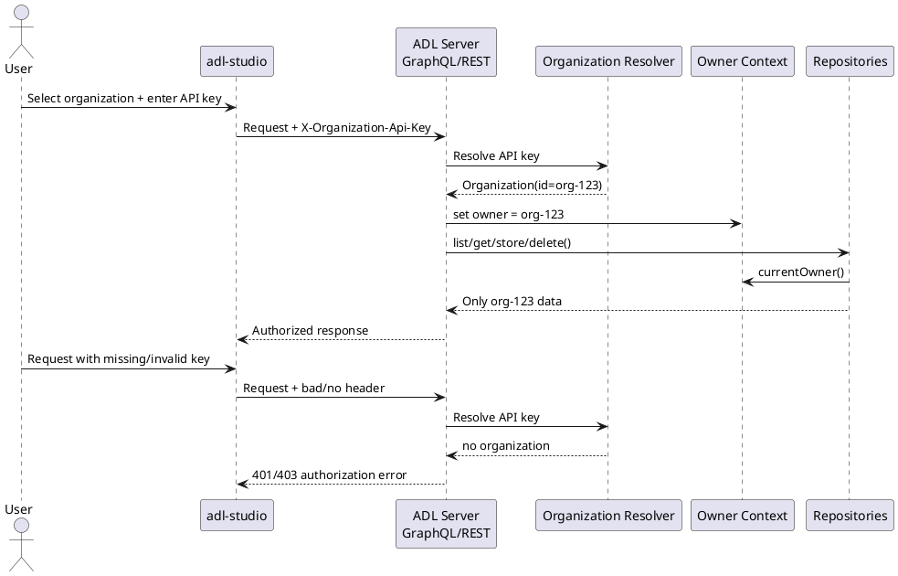

# 🧩 TechSpec: Organisations and API-Key Based Owner Access
**ID:** organisations-owner-access-v1  
**Service:** ADL Server + ADL Studio  
---

## 🧩Key Functional Requirements

### Functional Requirements

- Introduce a new domain model `Organization` with fields `id`, `name`, `descriptions`, and `apiKeys`.
- Use `Organization.id` as the canonical `owner` value for all owner-scoped repository models (`Adl`, `AdlVersion`, `Widget`, `TestCase`, `UserSettings`, `RolePrompt`, `Agent`).
- Only clients that provide a valid organization API key in a request header may read or mutate data owned by that organization.
- Add backend support for creating, listing, updating, rotating, and revoking organizations and API keys.
- Modify `adl-studio` so the selected organization and API key are attached to GraphQL, REST, and SSE requests.
- Preserve backwards compatibility for the current default owner `public` during rollout.

### Main Flow (step-by-step)

1. A client selects an organization in `adl-studio` and provides an organization API key.
2. `adl-studio` sends the API key in a dedicated header on GraphQL, OpenAI-compatible REST, and SSE requests.
3. `adl-server` resolves the API key to an `Organization`.
4. The resolved `Organization.id` is written into the request/coroutine owner context.
5. Repository calls read `currentOwner()` from context and only return or mutate records for that owner.
6. If the API key is missing or invalid, the backend returns an authorization error and does not expose owner-scoped data.

#### Sequence Diagram


### Inputs (explicit and structured)
| Field | Type | Example | Required | Constraints |
|-------|------|---------|----------|-------------|
| `id` | `String` | `telekom-demo` | Yes | Stable slug; unique; used as owner id |
| `name` | `String` | `Telekom Demo Org` | Yes | Human-readable display name |
| `descriptions` | `String` | `Internal sandbox organisation for support flows.` | Yes | Free-text or Markdown; displayed in UI |
| `apiKeys` | `List<ApiKey>` | `[{"label":"studio","maskedKey":"adl_...xyz"}]` | Yes | Stored hashed server-side; raw value only returned at creation time |
| `X-Api-Key` | `String` header | `adl_org_live_abc123` | Yes for owner-protected routes | Required on GraphQL, `/v1/chat/completions`, and `/events` |
| `organizationId` | `String` UI state | `telekom-demo` | Yes in Studio | Used for selection and management views |

### Outputs
| Field | Type | Description | Example |
|-------|------|-------------|---------|
| `organization` | `Organization` | Organization metadata without raw API keys | `{"id":"telekom-demo","name":"Telekom Demo Org"}` |
| `createdApiKey` | `String` | Raw key returned once during create/rotate | `adl_org_live_abc123` |
| `owner` | `String` | Resolved owner id in backend context | `telekom-demo` |
| `authorized` | `Boolean` | Whether the request was authorized for an organization | `true` |

Example Output:
```json
{
  "status": "success",
  "data": {
    "organization": {
      "id": "telekom-demo",
      "name": "Telekom Demo Org",
      "descriptions": "Internal sandbox organisation for support flows.",
      "apiKeys": [
        {
          "id": "key-1",
          "label": "studio",
          "maskedKey": "adl_org_live_...123",
          "createdAt": "2026-03-14T10:15:00Z",
          "revoked": false
        }
      ]
    }
  }
}
```

### Error Cases

| Error Scenario | HTTP Status Code | Response Behavior | Details |
|----------------|------------------|-------------------|---------|
| Missing `X-Api-Key` on protected route | `401` | Reject request | Applies to GraphQL owner-protected queries/mutations, `/v1/chat/completions`, `/events` |
| Invalid or revoked API key | `403` | Reject request | Do not reveal whether organization exists |
| Organization ID already exists | `409` | Reject create/update | Backend validation in organization mutation/repository |
| Accessing data owned by another organization | `404` or `403` | Do not leak cross-org existence | Prefer “not found” for owner-scoped lookups |
| Raw API key requested after creation | `400` | Reject request | API keys must be masked after initial issuance |
| SSE connection without valid key | `401` | Reject stream setup | `adl-studio/src/lib/events.ts` must send header via polyfill |
|

### 🧩Non-Functional Requirements

- **Performance:** Organization lookup must happen once per inbound request, then reuse coroutine context owner resolution for repository calls.
- **Scalability:** Support many organizations with overlapping model IDs because owner isolation is based on `(owner, id)` semantics.
- **Security:** API keys must be stored hashed, compared in constant time, masked in responses, and rotatable/revocable without downtime.
- **CORS:** Allow the organization API-key header through Ktor CORS configuration in `AdlServer.kt`.
- **Backwards compatibility:** Keep `public` as the implicit owner for development and migration until all clients are organization-aware.

### Artifacts and External Specs

- Backend request owner setup currently lives in `adl-server/src/main/kotlin/OwnerSupport.kt`; `DefaultKtorGraphQLContextFactory` currently hard-codes `public`.
- GraphQL is wired manually in `adl-server/src/main/kotlin/AdlServer.kt`; organization repository, queries, mutations, and context resolution must be added there.
- OpenAI-compatible REST currently has no auth in `adl-server/src/main/kotlin/inbound/rest/OpenAICompletionsHandler.kt`; it must resolve owner from the API-key header before executing the agent.
- Owner-scoped persistence already exists in repository models such as `adl-server/src/main/kotlin/models/UserSettings.kt` and `adl-server/src/main/kotlin/models/RolePrompt.kt`.
- PostgreSQL ADL storage is defined in `adl-server/src/main/resources/db/migration/V1__create_adl_tables.sql`; organizations need their own migration (e.g. `organizations` and `organization_api_keys`) plus any owner/index adjustments.
- `adl-studio/src/components/providers.tsx` must add header injection to the URQL client.
- `adl-studio/src/lib/events.ts` must send the organization API key in the SSE connection headers.
- `adl-studio` needs organization management screens, likely near existing settings flows in `src/app/settings/page.tsx` and GraphQL query/mutation definitions in `src/lib/graphql/{queries,mutations}.ts`.

## Proposed Backend Design

### Domain Model

Add:

- `Organization`
  - `id: String`
  - `name: String`
  - `descriptions: String`
  - `apiKeys: List<OrganizationApiKey>`
- `OrganizationApiKey`
  - `id: String`
  - `label: String`
  - `hashedKey: String`
  - `maskedKey: String` (response DTO only)
  - `createdAt: String`
  - `revoked: Boolean`

### Repository / Persistence

- Add `OrganizationRepository` under `adl-server/src/main/kotlin/repositories`.
- Provide in-memory implementation first; add PostgreSQL implementation if org metadata must survive restarts in production.
- Store only hashed API keys; raw keys are generated server-side and returned once.
- Owner resolution flow:
  1. read `X-Api-Key`
  2. resolve to `Organization`
  3. set coroutine owner context to `Organization.id`
  4. repository access uses `currentOwner()`
- Existing owner-aware repositories must remain parameterless; no owner argument should leak into resolver signatures or service APIs.

### GraphQL / REST

Add GraphQL operations:

- Queries
  - `organizations`
  - `organization(id: String)`
- Mutations
  - `createOrganization(...)`
  - `updateOrganization(...)`
  - `createOrganizationApiKey(...)`
  - `revokeOrganizationApiKey(...)`

Auth behavior:

- Organization-management operations should initially be restricted to `public` owner or a bootstrap admin mode.
- Owner-protected data operations must require a valid org API key.
- `OpenAICompletionsHandler.kt` and SSE route setup must apply the same organization resolution as GraphQL.

## Proposed ADL Studio Design

### UI Changes

- Add an organization selector and API-key input in settings.
- Add organization management UI for:
  - create organization
  - edit name / descriptions
  - create API key
  - revoke API key
- Persist selected organization + API key in browser state/storage for local development convenience.
- Clearly mask stored keys in the UI; raw keys are shown only once after creation.

### Client Transport Changes

- `src/components/providers.tsx`
  - inject `X-Api-Key` into URQL requests
- `src/lib/events.ts`
  - pass `X-Api-Key` through `EventSourcePolyfill` headers
- any REST calls to `/v1/chat/completions`
  - include the same header

### UX Expectations

- If the API key is invalid, show a clear auth error and do not silently fall back to `public`.
- If no organization is selected, Studio may offer a `public` development mode only when explicitly enabled.
- Organization switching should trigger data reloads for ADLs, widgets, tests, agents, prompts, and settings.

## Delivery Slices

1. **Backend foundation**
   - organization model/repository
   - API-key hashing + lookup
   - request owner resolution from header
2. **Protected access**
   - GraphQL + REST + SSE enforce org API keys
   - repository reads/writes isolated by resolved owner
3. **Studio integration**
   - organization selection
   - header propagation
   - organization management UI
4. **Migration / compatibility**
   - preserve `public`
   - add migration path for existing data and local file storage

## Definition of Done Checklist

### Documentation
- [x] GraphQL schema docs updated with organization query/mutation definitions
- [x] Sequence diagram and data model added to `/docs/` in PlantUML format
- [x] `adl-server/README.md` updated with header examples for GraphQL, SSE, and `/v1/chat/completions`
- [x] Inline code documentation complete for organization/auth components

### Quality
- [x] Unit tests cover organization repository, API-key hashing, masking, and owner resolution
- [x] Integration tests cover GraphQL, REST, and SSE with valid and invalid organization API keys
- [x] Owner isolation tests cover ADLs, widgets, test cases, agents, prompts, settings, and tags
- [ ] Studio typecheck/lint pass and organization switching is covered in UI tests where available
- [ ] Code review completed
- [ ] Security check. Verify that the application follows best practises for security.

## Updates / Issues

- [x] 2026-03-14: Initial tech spec drafted from the current codebase state where `DefaultKtorGraphQLContextFactory` still resolves all GraphQL requests to `public` and `adl-studio` does not yet send auth headers.
- [x] 2026-03-14: DoD checklist verified against implemented artifacts and executed backend tests. Documentation and backend test items are complete. Remaining open items are (a) Studio `typecheck`/`lint`, because `adl-studio` currently has pre-existing TypeScript issues outside the organization changes and no visible UI test coverage for organization switching, (b) code review approval, which cannot be verified from the repository state alone, and (c) the security checklist item, because a dependency review still shows visible HIGH-severity findings for `org.postgresql:postgresql@42.7.5` and `next@15.5.9`.
- [x] 000001: It should not be possible to see organizations for which the user does not have a valid API key.
- [x] 000002: The current selected organization should be displayed in the UI header.
- [x] 2026-03-14: Implemented issue `000001` by restricting organization queries to `public` plus the currently authorized organization derived from the request owner context, and by removing the global public organization listing from the Studio settings UI.
- [x] 2026-03-14: Implemented issue `000002` by showing the currently saved organization context in the Studio header and keeping it synchronized via the local organization access state.
- [x] 000003: UI for managing organizations needs improvements. Activating organization should require either a valid API key or selecting the public organization. By entering a valid api key the organization to be identified automatically and displayed in the header on each page. By clicking on the organization in the header, a user should be able to switch between available organizations. 
- [x] 000004: The panel to create a new organization must not show the public organization.
- [x] 2026-03-14: Implemented issue `000003` by splitting Studio organization access into active vs. authorized context, resolving organizations from API keys instead of free-text ids, preserving a switchable `public` mode, and adding a header dropdown to switch between `public` and the locally authorized organization.
- [x] 2026-03-14: Implemented issue `000004` by separating “create organization” from “manage authorized organization” in `adl-studio/src/app/settings/page.tsx`, ensuring the creation panel only accepts new non-`public` ids.
- [x] 000005: Move the organization management to a new page.
- [x] 000006: Organizations must have at least one API key. The last API key can be rotated but not revoked.
- [x] 000007: It should be possible to deleted organizations.
- [x] 2026-03-14: Implemented issue `000005` by moving organization access and management from `adl-studio/src/app/settings/page.tsx` into the dedicated route `adl-studio/src/app/organizations/page.tsx`, and by linking it from the header and settings page.
- [x] 2026-03-14: Implemented issue `000006` by adding backend-enforced protection against revoking the last active organization API key, plus an atomic rotation mutation and Studio UI actions that expose rotation while disabling revoke for the final active key.
- [x] 2026-03-14: Implemented issue `000007` by adding backend organization deletion with owner-scoped data purge, a GraphQL delete mutation, and a Studio confirmation flow on the new organizations page.
- [x] 000008: "Last active API key protection" notification should be shown above "Manage Authorized Organization"
- [x] 000009: Remove "Initial API key label". Initial key name should be master.
- [x] 000010: Issuing a new API key should require the input of a name.
- [x] 000011: When creating a new organization or new key the user should be able to see the generated API key in a modal with the option to copy it. The API key should be shown only once and masked in the list of API keys.
- [x] 2026-03-14: Implemented issues `000008`-`000011` by moving the last-key protection alert above the management section, removing the initial-key label input in favor of a fixed `master` default, requiring an explicit name for additional API keys, and showing newly issued raw API keys only once in a copyable Studio modal.
