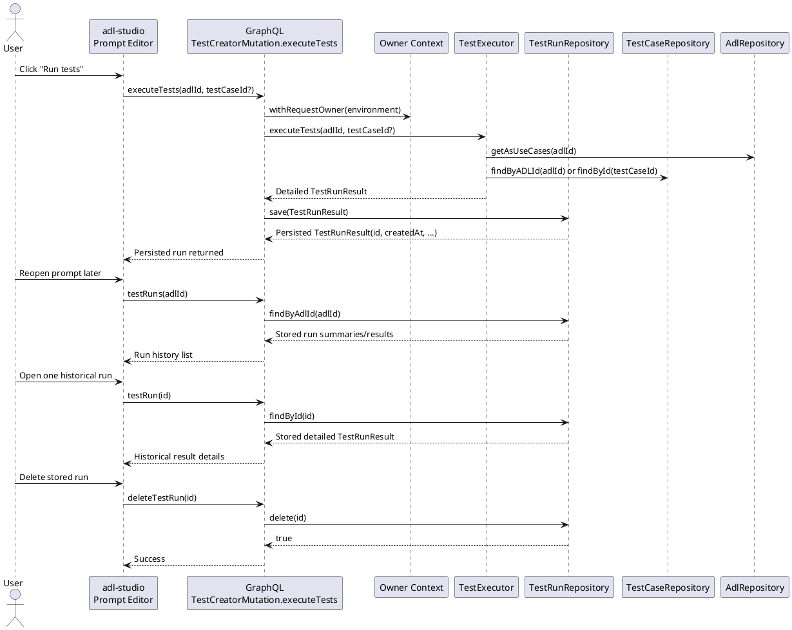

<!--
SPDX-FileCopyrightText: 2026 Deutsche Telekom AG and others

SPDX-License-Identifier: CC-BY-4.0
-->
# 🧩 TechSpec: Persisted Test Run History and Detailed Results
**ID:** test-run-history-v1  
**Service:** ADL Server + ADL Studio  
---

## 🧩Key Functional Requirements

### Functional Requirements

- Persist every `executeTests` run so the UI can display previous results without re-running the tests.
- Extend `TestRunResult` with run metadata (`id`, `adlId`, `createdAt`, `owner`, optional `requestedTestCaseId`) and detailed test snapshots.
- Ensure each stored result contains enough detail to explain what was executed, including the executed test case snapshot and the concrete conversation variant that was used.
- Add backend support to list persisted test runs for an ADL, fetch a single stored test run, and delete stored test runs.
- Keep owner isolation identical to existing test cases, ADLs, widgets, prompts, and settings by scoping all persisted test runs to the resolved `owner`.
- Update `adl-studio` so test history can be viewed after page reloads and individual test runs can be deleted from the UI.

### Main Flow (step-by-step)

1. A user opens a prompt in `adl-studio` and triggers `executeTests` for one test case or for the full test suite.
2. `adl-server` resolves the current owner and executes the selected tests through `TestExecutor`.
3. `TestExecutor` produces a detailed `TestRunResult` that contains run metadata and detailed per-test snapshots.
4. The backend stores the `TestRunResult` through a new `TestRunRepository` before returning it to the client.
5. `adl-studio` displays the fresh result immediately and stores only the selected run id in UI state.
6. Later, `adl-studio` reloads the run history via GraphQL queries and can reopen any stored run without re-executing tests.
7. If the user deletes a test run, the backend removes the persisted record for the current owner only.

#### Sequence Diagram


### Inputs (explicit and structured)
| Field | Type | Example | Required | Constraints |
|-------|------|---------|----------|-------------|
| `adlId` | `String` | `password_reset` | Yes | Must reference an ADL visible to the current owner |
| `testCaseId` | `String` | `test-123` | No | If present, must belong to the current owner and ADL |
| `id` | `String` | `testrun-456` | Yes for lookup/delete | Stable persisted test run identifier |
| `owner` | `String` | `telekom-demo` | Implicit | Derived from request owner context, never accepted from client |
| `limit` | `Int` | `20` | No | Default `20`, maximum `100` for listing |
| `includeDetails` | `Boolean` | `true` | No | Optional optimization for history list responses |

### Outputs
| Field | Type | Description | Example |
|-------|------|-------------|---------|
| `id` | `String` | Unique identifier of the persisted test run | `testrun-456` |
| `adlId` | `String` | ADL against which the run was executed | `password_reset` |
| `owner` | `String` | Owner/org of the stored run | `telekom-demo` |
| `createdAt` | `String` | ISO-8601 timestamp of execution | `2026-03-14T18:42:11Z` |
| `requestedTestCaseId` | `String?` | The originally requested single test case, if any | `test-123` |
| `overallScore` | `Double` | Average score across returned results | `83.5` |
| `results` | `List<TestExecutionResult>` | Detailed execution results | `[{...}]` |
| `testCase` | `TestCase` | Embedded snapshot of the executed test case | `{"id":"test-123","name":"Happy path"}` |
| `executedVariantIndex` | `Int` | Which generated variant produced the stored result | `3` |
| `executedConversation` | `List<ConversationTurn>` | Concrete input turns used for the run | `[{"role":"user","content":"I forgot my password"}]` |
| `failureReason` | `String?` | Agent/runtime failure summary when available | `Agent execution failed: timeout` |

Example Output:
```json
{
  "status": "success",
  "data": {
    "executeTests": {
      "id": "testrun-456",
      "adlId": "password_reset",
      "owner": "telekom-demo",
      "createdAt": "2026-03-14T18:42:11Z",
      "requestedTestCaseId": null,
      "overallScore": 83.5,
      "results": [
        {
          "testCaseId": "test-123",
          "testCaseName": "Happy path",
          "status": "PASS",
          "score": 92,
          "executedVariantIndex": 3,
          "executedConversation": [
            { "role": "user", "content": "I forgot my password" },
            { "role": "assistant", "content": "I can help you reset it." }
          ],
          "testCase": {
            "id": "test-123",
            "name": "Happy path",
            "description": "Standard password reset flow",
            "contract": true
          },
          "details": {
            "verdict": "pass",
            "score": 92,
            "reasons": ["Correct reset flow was followed"],
            "missingRequirements": [],
            "violations": []
          },
          "useCases": ["password_reset"]
        }
      ]
    }
  }
}
```

### Error Cases

| Error Scenario | HTTP Status Code | Response Behavior | Details |
|----------------|------------------|-------------------|---------|
| ADL not found | `400` / GraphQL error | Reject execution | Mirrors current `TestExecutor.executeTests` behavior |
| Test case not found | `400` / GraphQL error | Reject execution | Applies when `testCaseId` does not resolve for current owner |
| No persisted run for id | `404` or GraphQL `null` | Do not leak cross-owner existence | Prefer owner-scoped lookup semantics |
| Delete of missing test run | `404` or `false` | Safe no-op or explicit not-found | Should match repo conventions used for widgets/test cases |
| Persisting run fails after execution | `500` / GraphQL error | Execution result must not be silently lost | Return error unless an explicit fallback mode is defined |
| Unauthorized access to another owner’s run | `404` or `403` | Hide existence | Must align with current owner-scoped repository strategy |
|

### 🧩Non-Functional Requirements

- **Performance:** Persisting a run must add only one repository write after execution; history list responses should support pagination or limits to avoid loading unbounded payloads.
- **Scalability:** Support many stored runs per ADL by indexing on `(owner, adlId, createdAt)` and by allowing configurable retention or future archival.
- **Security:** Stored results may contain generated assistant output and evaluation details; they must remain owner-scoped and must not be visible across organizations.
- **Durability:** Persistence strategy should follow the same runtime selection rules as other repositories where practical (PostgreSQL if configured, otherwise file-system, otherwise in-memory).
- **Compatibility:** Existing callers of `executeTests` should continue to work when additional fields are added to `TestRunResult`.

### Artifacts and External Specs

- Current execution entrypoint: `adl-server/src/main/kotlin/inbound/mutation/TestCaseMutation.kt`
- Current execution logic: `adl-server/src/main/kotlin/services/TestExecutor.kt`
- Current result models: `adl-server/src/main/kotlin/models/TestRunResult.kt` and `adl-server/src/main/kotlin/models/TestExecutionResult.kt`
- Current test case persistence: `adl-server/src/main/kotlin/repositories/TestCaseRepository.kt` and `adl-server/src/main/kotlin/repositories/impl/FileSystemTestCaseRepository.kt`
- Current folder resolution: `adl-server/src/main/kotlin/AdlServer.kt` and `adl-server/src/main/kotlin/EnvConfig.kt`
- Current prompt UI test execution flow: `adl-studio/src/app/prompts/page.tsx`
- Current GraphQL client contract: `adl-studio/src/lib/graphql/mutations.ts` and `adl-studio/src/lib/graphql/queries.ts`

## Proposed Backend Design

### Domain Model Changes

#### Extend `TestRunResult`

Add persisted run metadata to `TestRunResult`:

- `id: String`
- `adlId: String`
- `owner: String`
- `createdAt: String`
- `requestedTestCaseId: String?`
- `overallScore: Double`
- `results: List<TestExecutionResult>`

#### Extend `TestExecutionResult`

Add per-test detail fields so the UI can explain what happened without re-executing:

- `testCase: TestCase` — embedded snapshot at execution time
- `executedVariantIndex: Int?` — which generated variant was used for the stored result
- `executedConversation: List<ConversationTurn>` — concrete conversation variant that was executed
- `failureReason: String?` — explicit failure summary, separate from evaluation output
- keep existing fields:
  - `testCaseId`
  - `testCaseName`
  - `status`
  - `score`
  - `actualConversation`
  - `useCases`
  - `details`

This preserves backwards compatibility while making the stored result self-contained.

### Repository / Persistence

Introduce `TestRunRepository` under `adl-server/src/main/kotlin/repositories`.

Recommended contract:

- `suspend fun save(result: TestRunResult): TestRunResult`
- `suspend fun findById(id: String): TestRunResult?`
- `suspend fun findByAdlId(adlId: String, limit: Int = 20): List<TestRunResult>`
- `suspend fun delete(id: String): Boolean`
- `suspend fun deleteByAdlId(adlId: String): Int` (optional for future cleanup)

Recommended runtime selection order in `AdlServer.kt`:

1. PostgreSQL when `DATABASE_URL` is configured
2. `TEST_RUN_FOLDER` if explicitly configured
3. `<ADL_FOLDER>/test-runs` when `ADL_FOLDER` is configured
4. local `adls/test-runs` when `adls/` exists
5. fallback to in-memory

This keeps test-run persistence aligned with the existing ADL/test-case/widget fallback model.

### Execution Flow Changes

Modify `TestExecutor.executeTests` so that it can produce a persistable snapshot.

Recommended split:

- `executeTests(...)` returns a fully detailed `TestRunResult`
- `runSingleTestCase(...)` returns enough detail to know
  - which variant was executed
  - what input conversation was used
  - what failure reason occurred
- persistence should happen in the GraphQL mutation layer or a dedicated orchestration component after owner resolution is already active

Recommended orchestration in `TestCaseMutation.kt` / `TestCreatorMutation.executeTests`:

1. resolve owner via `withRequestOwner`
2. call `testExecutor.executeTests(...)`
3. enrich the returned object with `id`, `adlId`, `owner`, `createdAt`, `requestedTestCaseId`
4. save through `testRunRepository`
5. return the saved run

### GraphQL Additions

Add queries in `TestCaseQuery.kt` (or split into a dedicated query class if preferred):

- `testRuns(adlId: String, limit: Int = 20): List<TestRunResult>`
- `testRun(id: String!): TestRunResult`

Add mutation in `TestCaseMutation.kt` / `TestCreatorMutation`:

- `deleteTestRun(id: String!): Boolean`

GraphQL response shape should keep `executeTests` as the write-and-return entrypoint, now returning the persisted run object.

## Proposed ADL Studio Design

### UI Changes

In `adl-studio/src/app/prompts/page.tsx`:

- after `executeTests`, keep using the returned result for immediate display
- add a history query on prompt load to fetch previous runs for the current `adlId`
- show a “Test Runs” list near the current `TestCases` or `PerformanceCharts` area
- selecting a historical run hydrates:
  - score
  - reasons / verdict
  - detailed per-test result cards
- add a delete action for each stored run with confirmation dialog

### Client GraphQL Changes

Add queries in `adl-studio/src/lib/graphql/queries.ts`:

- `TestRunsQuery(adlId, limit)`
- `TestRunQuery(id)`

Add mutation in `adl-studio/src/lib/graphql/mutations.ts`:

- `DeleteTestRunMutation(id)`

Extend the existing `ExecuteTestsMutation` selection set to request the new metadata/detail fields.

### UX Expectations

- Running tests should immediately append the new run to the history list.
- Historical runs should remain viewable after reload.
- Deleting a run should remove it from the list without affecting test cases themselves.
- The UI should clearly distinguish:
  - persisted test runs
  - reusable test cases
- If a stored run was generated from a single test case, the history card should show that scope explicitly.

## Data Model Notes

### Why store snapshots instead of references only?

`TestCase` definitions can change over time via `updateTest` and `addTest`. If a stored run only keeps ids, historical results become ambiguous. Persisting the embedded test case snapshot and executed variant preserves the factual state of the run at execution time.

### Recommended Storage Shape

A single `TestRunResult` should represent one execution request and contain `results[]` for all included test cases. This matches the current `executeTests` contract and is more efficient than persisting one top-level record per test case.

## Delivery Slices

1. **Model and repository foundation**
   - add `TestRunRepository`
   - add in-memory implementation
   - extend `TestRunResult` and `TestExecutionResult`
2. **Execution persistence**
   - persist `executeTests`
   - store run metadata and test snapshots
3. **Read/delete API**
   - list single run and history
   - delete stored run
4. **Studio history UI**
   - list runs
   - open details
   - delete runs
5. **Optional persistence hardening**
   - file-system and PostgreSQL implementations
   - retention and cleanup strategies

## Definition of Done Checklist

### Documentation
- [ ] GraphQL schema docs updated with `testRuns`, `testRun`, `deleteTestRun`, and the extended `executeTests` response
- [ ] Sequence diagram and data model added to `/docs/` in PlantUML format
- [ ] `adl-server/README.md` updated with examples for executing, listing, and deleting test runs
- [ ] Inline code documentation complete for repository, execution orchestration, and GraphQL entrypoints

### Quality
- [ ] Unit tests cover repository persistence, snapshot serialization, and detailed result mapping
- [ ] Integration tests cover execute/list/get/delete flows and owner isolation for stored runs
- [ ] Studio typecheck/lint pass and history/delete UI behavior is covered where test infrastructure exists
- [ ] Code review completed and approved
- [ ] Security check confirms owner isolation and safe handling of persisted conversation/evaluation data

## Updates / Issues

- [x] 2026-03-14: Initial tech spec drafted from the current codebase state where `executeTests` returns an ephemeral `TestRunResult` without persistence and the UI only displays the latest in-memory result.
- [ ] Open design question: should PostgreSQL support for persisted test runs be required in the first slice, or can file-system plus in-memory support ship first?
- [ ] Open design question: should test-run history list responses return full `results[]` by default, or a lightweight summary projection plus a detail query?

